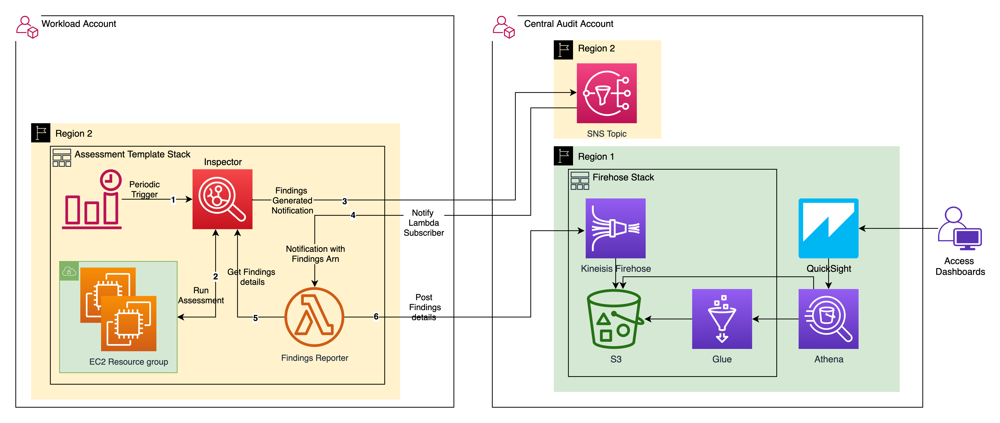
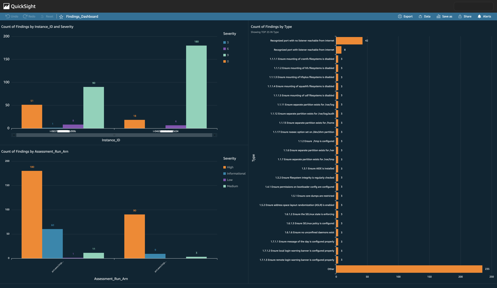
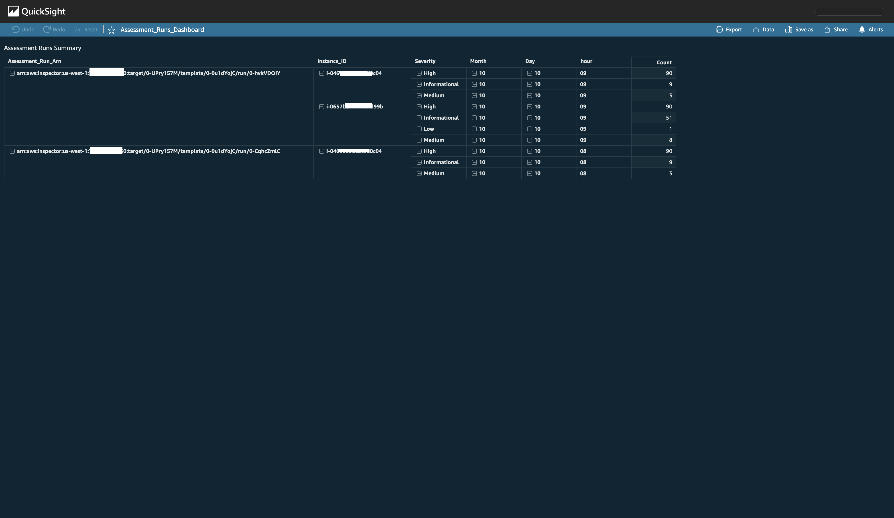

## Visualize Amazon Inspector findings using Amazon Glue, Amazon Athena and Amazon QuickSight
This project contains the TypeScript CDK to deploy Amazon Inspector assessment templates in multiple workload accounts, and process Inspector findings in a central account.
Deploy multiple assessment template stacks across workload accounts, which send the findings details to the central Firehose with S3 destination.
A Glue crawler scheduled with a cron expression catalogs the S3 data at regular intervals, and QuickSight dashboards are used to query the catalog using an Athena datasource.

## Architecture



## Steps to deploy the Inspector-Assessment-Template stack and Central-Firehose stack

* ### Pre-requisites
  * Install AWS CLI, Git, Node.js, TypeScript
  * Install AWS CDK v1.120+
  * Atleast 2 AWS accounts are required - (to be used as Workload and Central accounts)
  * In the central account, to store the Athena query results, create/re-use an S3 bucket
  <br>

* ### Product versions
  * AWS CDK V1.120
  * AWS SDK for Python (Boto3) V1.18
  * Python 3.7+
  * Node.js 14, TypeScript V3.9
  <br>

* ### Limitations
  * QuickSight is not available in us-west-1, do not use us-west-1 for region2 below

* ### Setup SNS Topics, Firehose, Glue Crawler and Athena domain in Central account

  ```shell
  # Configure aws named-profiles for workload and central environments
  aws configure --profile workload_region1
  aws configure --profile central_region2
  # if region1 is different from region2, create profile central_region1
  aws configure --profile central_region1
  
  # Clone repository
  git clone https://github.com/aws-samples/amazon-inspector-glue-athena-cdk
  cd amazon-inspector-glue-athena-cdk
  
  # Install NodeJS dependencies
  npm i
  
  # Build CDK stacks
  cdk synth
  
  # Create SNS Topics
  cdk deploy sns-topics-stack --profile central_region1
  
  # Update SNS Topic names in cdk.context.json. 
  # Create Firehose stream, Glue Crawler
  cdk deploy firehose-glue-stack --profile central_region2
  ```

* ### Deploy Inspector-Assessment-Template Stack
  ```shell
  # Create Inspector-Assessment-Template in workload account
  cdk deploy assessment-template-stack --profile workload_region1
  
  ```

* ### To import data into QuickSight dashboards

  ```shell
  # Start an assessment run from the Assessment template deployed in workload account
  # Findings will be delivered to S3 destination. Start Glue Crawler run
  # Inspector database and inspector_findings table will be created in Glue Data catalog
  # Create a QuickSight user. Choose default IAM Role. Provide QuickSight access to the Firehose destination S3 bucket
  # Create a Athena dataset in QuickSight. Create an analysis in QuickSight using the Athena dataset and publish dashboards
  ```
* ### QuickSight references
  * https://docs.aws.amazon.com/quicksight/latest/user/create-a-data-set-athena.html
  * https://docs.aws.amazon.com/quicksight/latest/user/creating-an-analysis.html
  * https://docs.aws.amazon.com/quicksight/latest/user/creating-a-visual.html
  
## QuickSight Dashboards for Inspector Findings





## License

This library is licensed under the MIT-0 License. See the LICENSE file.